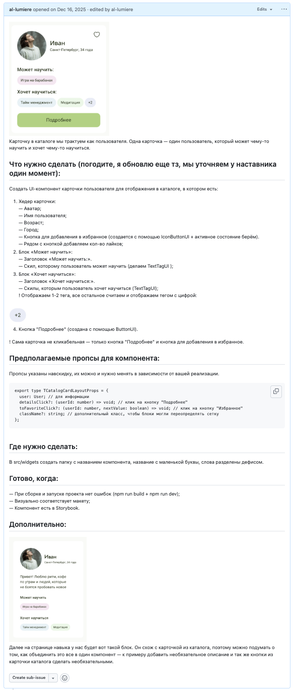
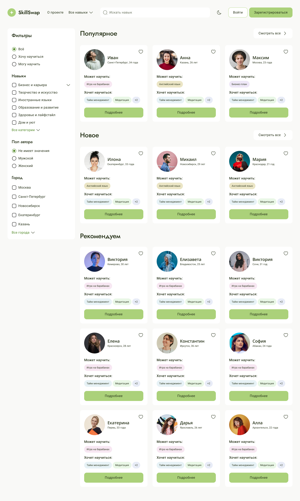
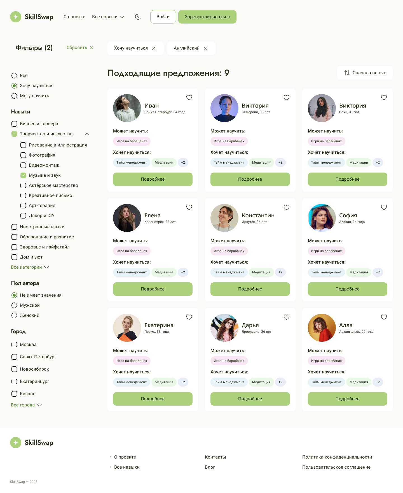
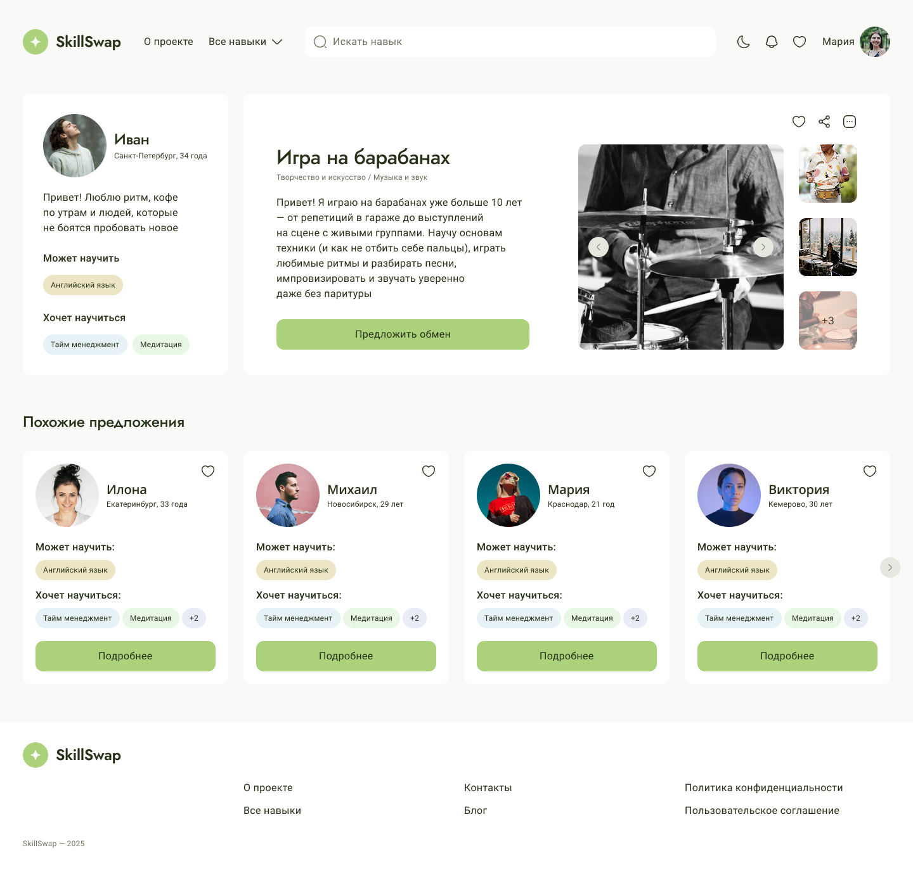
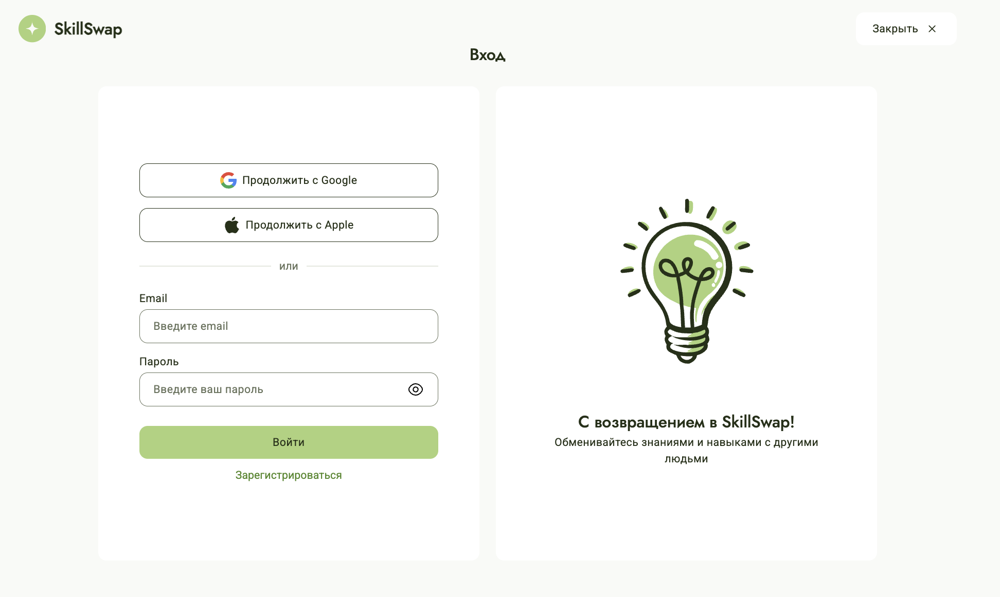
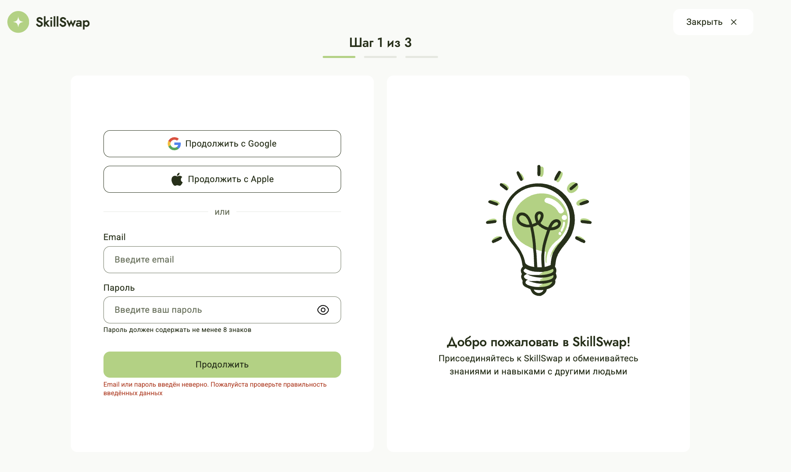
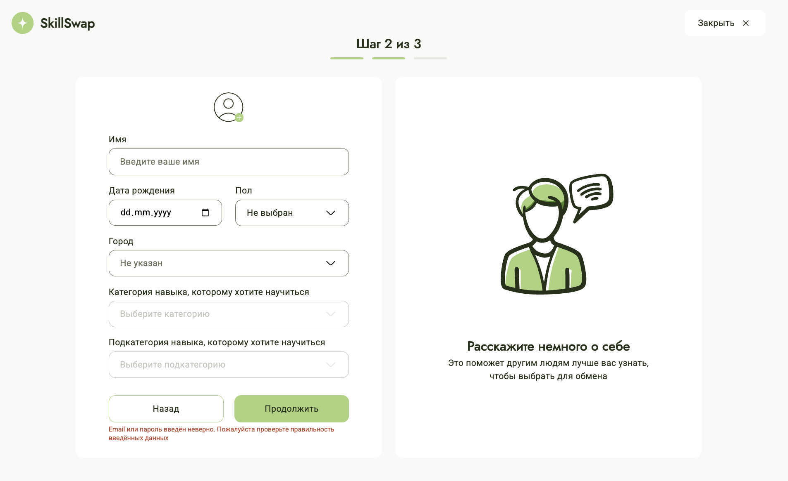
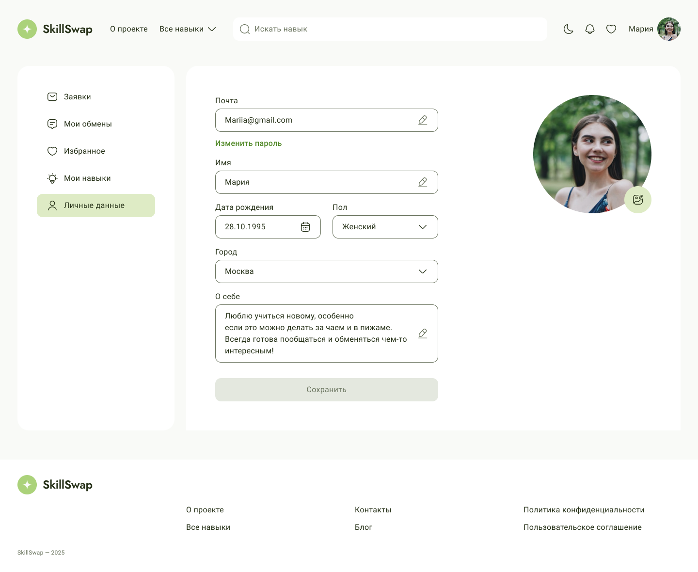

# SkillSwap

SkillSwap is a peer-to-peer learning marketplace where people can teach what they know and learn what they need from others through skill exchange.

> **Status:** This repository contains the final state of a team project. The original backend service may currently be unavailable, so some API-dependent features might not work in local development.

## Overview

SkillSwap is a web platform built around the idea of knowledge exchange.
Users can share their skills, discover what others offer, and find opportunities to learn from each other in a marketplace-style experience.

This repository is maintained as a portfolio version of the project to showcase the product concept, frontend implementation, UI structure, and my contribution as part of a team.

## Features

- peer-to-peer skill exchange concept
- marketplace-style browsing experience
- search and discovery flow
- reusable UI components
- responsive interface
- frontend architecture based on React and TypeScript
- component-driven development with Storybook

## Tech Stack

- React
- TypeScript
- Vite
- Storybook
- ESLint
- Prettier
- Redux Toolkit
- React Router
- CSS Modules
- API layer

## My Contribution

This project was developed as part of a team, where I contributed as a frontend developer and actively participated in the development process.
My responsibilities included both hands-on development and coordination tasks.

My work included:
- developing reusable UI components (cards, filters, popovers, profile UI)
- implementing key pages such as login, registration, and skill pages
- fixing bugs in logic, styling, and component behavior
- working with component architecture and Storybook
- reviewing pull requests and improving team code quality
- helping decompose features and organize development tasks

I also assisted the team lead by supporting task definition and participating in the development process.

### Task Decomposition Example

As part of my contribution, I was also involved in task definition and decomposition.

Below is an example of how I structured a UI task for the team:



This includes:
- detailed UI requirements
- component structure
- expected props and behavior
- acceptance criteria for implementation

This helped align development across the team and ensured consistent UI implementation.

## Project Status

The original backend for this project may no longer be active, which means some features that depend on the API may not work as expected in local development.

This repository is kept as a portfolio project to demonstrate:

- the product idea
- frontend implementation
- component architecture
- user interface design
- teamwork and contribution to a shared codebase

## Getting Started

### Clone the repository

```bash
git clone https://github.com/al-lumiere/SkillSwap.git
cd SkillSwap
```
## Screenshots







